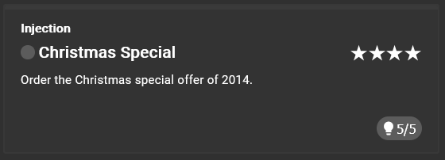
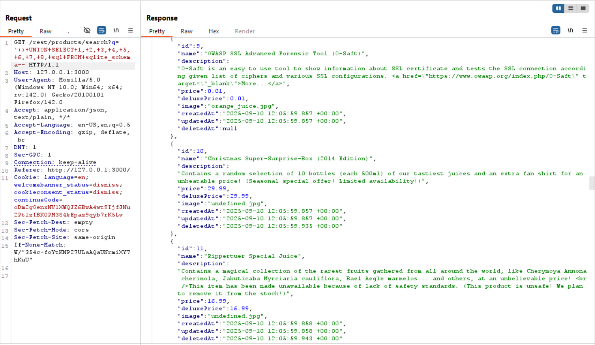
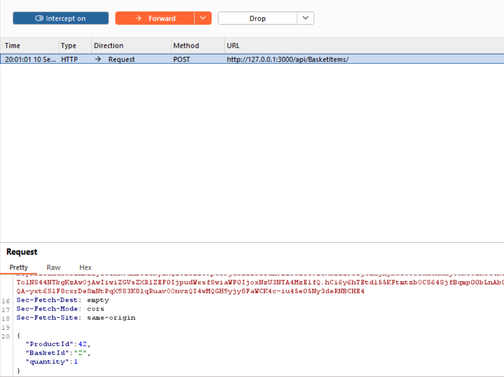
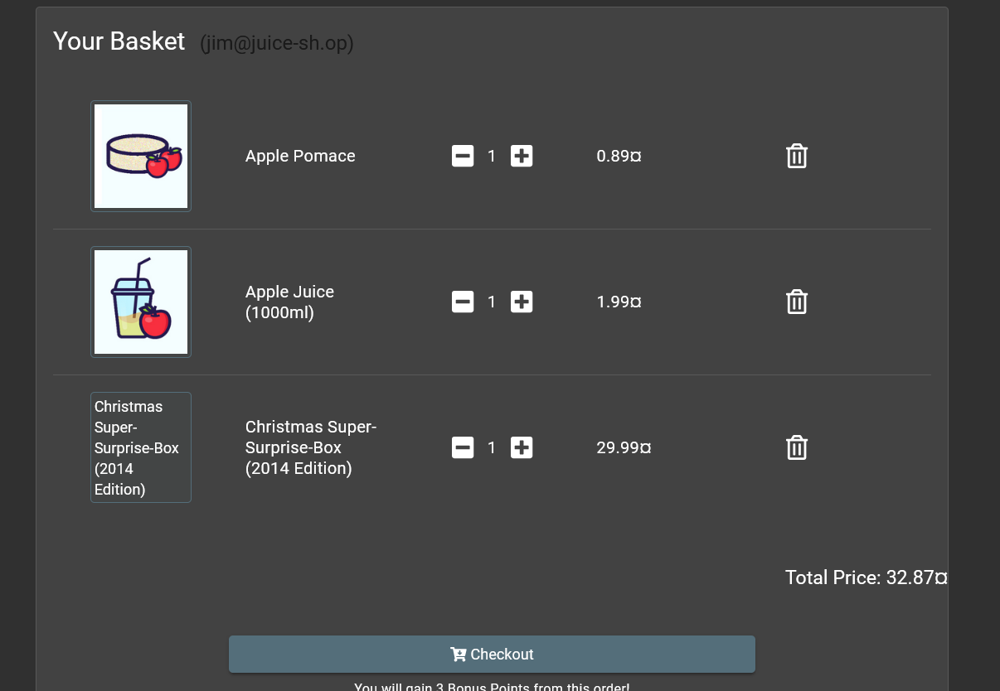
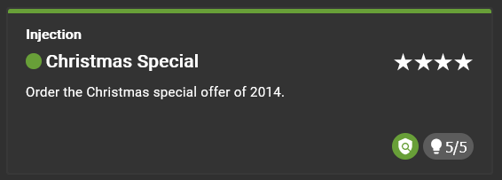

# Christmas Special



## Clue provided

1. Find out how the application handles unavailable products and try to find a loophole.
2. Find out how the application hides deleted products from its customers.
3. Try to craft an attack string that makes deleted products visible again.
4. You need to get the deleted product into your shopping cart and trigger the Checkout.
5. Neither of the above can be achieved through the application frontend and it might even require (half-)Blind SQL Injection.

## Solution

### Identifying vulnerability

From previous challenge, we know that there is an item with id 10 which is the "Christmas Special Offer of 2014".




### Exploiting the vulnerability

When we try to add to basket another item we get a post request to the following endpoint:

```
http://localhost:3000/api/BasketItems
```



we can change the `ProductId` to `10` to add the Christmas Special Offer of 2014 to our basket.



### Result 



