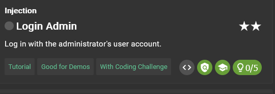
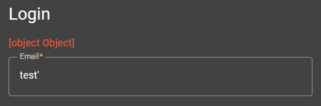
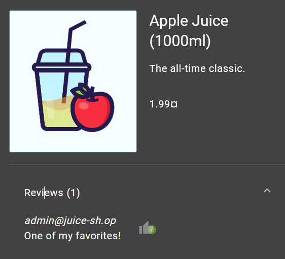
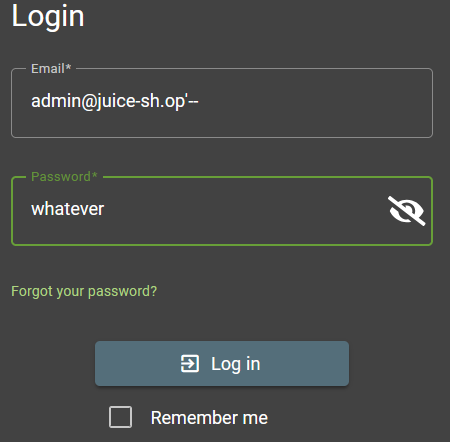

# Login Admin



## Clue provided

1. The challenge description probably gave away what form you should attack.
2. If you happen to know the email address of the admin already, you can launch a targeted attack.
3. You might be lucky with a dedicated attack pattern even if you have no clue about the admin email address.
4. If you harvested the admin’s password hash, you can of course try to attack that instead of using SQL Injection.
5. Alternatively you can solve this challenge as a combo with the Log in with the administrator’s user credentials without previously changing them or applying SQL Injection challenge.


## Solution


### Identifying vulnerability


When we try logging in using special characters such as quotes ('), we get an error message. This indicates that the input fields are vulnerable to SQL Injection.

### Exploiting the vulnerability

1. **Using Known Email Address**: If we know the admin's email address, we can use a simple SQL Injection payload to bypass the password check.



from the image above, we can see that the email address is `admin@juice-sh.op`.

1. **Using SQL Injection Payload**: We can use the following payload in the password field to bypass authentication:

```
admin@juice-sh.op'--
```

This payload comments out the rest of the SQL query, effectively ignoring the password check.



### Successful Login

After submitting the form with the SQL Injection payload, we are logged in as the admin.

