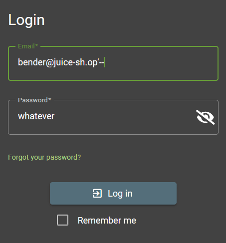

# Login Bender


## Clue provided

1. The challenge description probably gave away what form you should attack.
2. You need to know (or smart-guess) Bender’s email address so you can launch a targeted attack.
3. Bender's password hash might not help you very much.
4. In case you try some other approach than SQL Injection, you will notice that Bender’s password hash is not very useful.

## Solution

### Identifying vulnerability

We know already that login form is vulnerable to SQL Injection from previous challenges.

### Exploiting the vulnerability

1. **Knowing Bender's Email Address**: We need to know Bender's email address to perform a targeted SQL Injection attack.


from the image above, we can see that the email address is `bender@juice-sh.op`.

1. **Using SQL Injection Payload**: We can use the following payload in the password field to bypass authentication:

```
bender@juice-sh.op'--
```
This payload comments out the rest of the SQL query, effectively ignoring the password check.



### Successful Login

After submitting the form with the SQL Injection payload, we are logged in as Bender.

