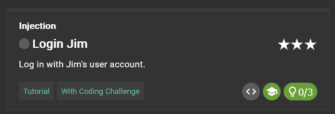
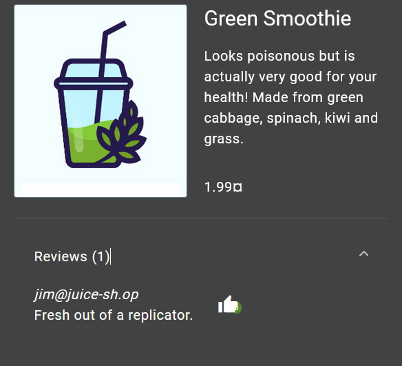
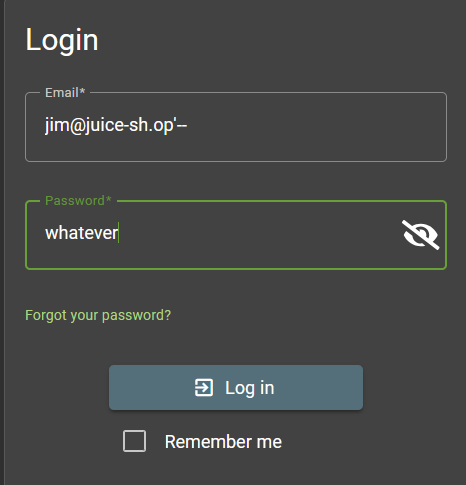
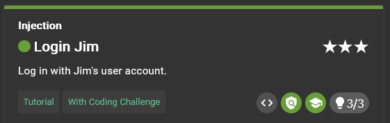

# Login Jim



## Clue provided

1. The challenge description probably gave away what form you should attack.
2. You need to know (or smart-guess) Jim’s email address so you can launch a targeted attack.
3. If you harvested Jim’s password hash, you can try to attack that instead of using SQL Injection.

## Solution

### Identifying vulnerability

We know already that login form is vulnerable to SQL Injection from previous challenges.

### Exploiting the vulnerability

1. **Knowing Jim's Email Address**: We need to know Jim's email address to perform a targeted SQL Injection attack.



from the image above, we can see that the email address is `jim@juice-sh.op`.

1. **Using SQL Injection Payload**: We can use the following payload in the password field to bypass authentication:

```
jim@juice-sh.op'--
```
This payload comments out the rest of the SQL query, effectively ignoring the password check.



### Successful Login

After submitting the form with the SQL Injection payload, we are logged in as Jim.

