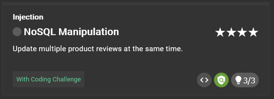
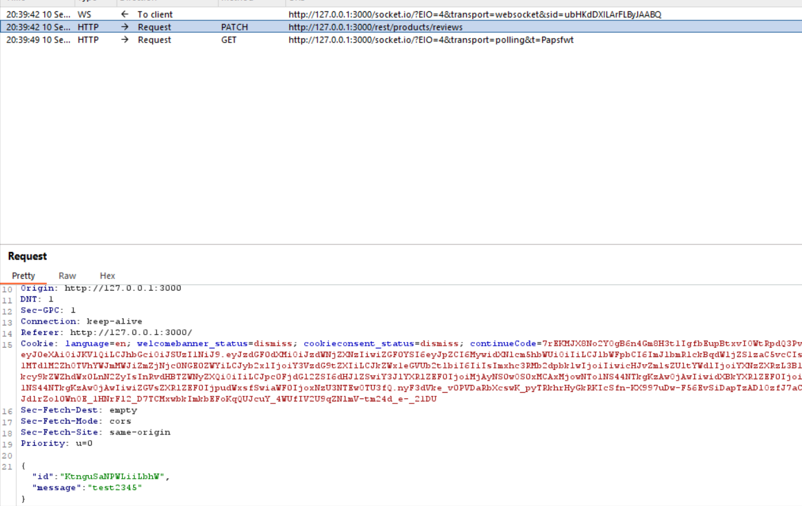
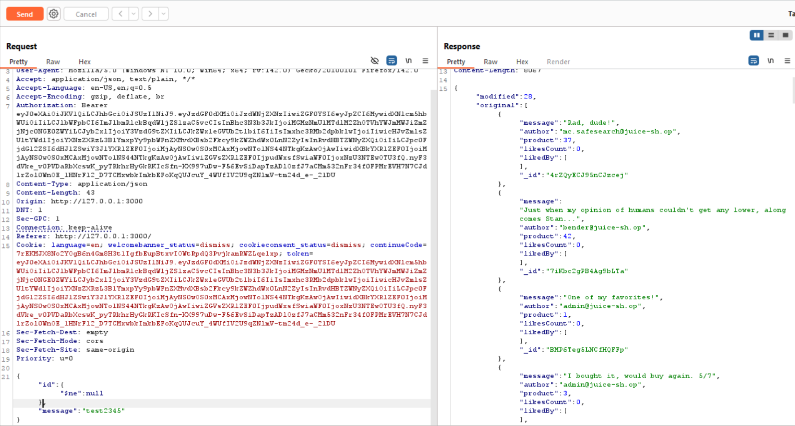
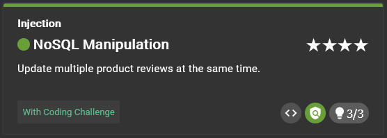

# NoSQL Injection



## Clue provided

1. Take a close look on how the equivalent of UPDATE-statements in MongoDB work.
2. This challenge requires another classic Injection attack.
3. It is also worth looking into how Query Operators work in MongoDB.

## Solution

### Identifying vulnerability

When we interrupt the edit review process with burpsuite, we can see that the patch request contains a JSON body with the review id and updated text.

```json
{
  "id": "1",
  "message": "test"
}
```



### Exploiting the vulnerability

we can intercept the patch request and modify the JSON body.

Change the id value to include a  query operator. For example, using `$ne` (not equal) will match any review id that is not equal to 1.

```json
{
  "id": { "$ne": null },
  "message": "test"
}
```
This will update all reviews because the condition `$ne: null` will match all review ids that are not null.



### Result



