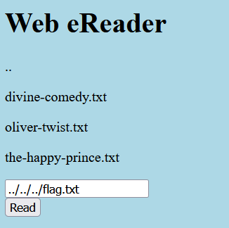

# Forbidden paths


## Identifying the vulnerability

We know the website is in /usr/share/nginx/html while the flag is in /flag.txt
but we cannot access it directly.

## Exploiting the vulnerability

We can use directory traversal to access the flag.

```
../../../flag.txt
```



### Result

