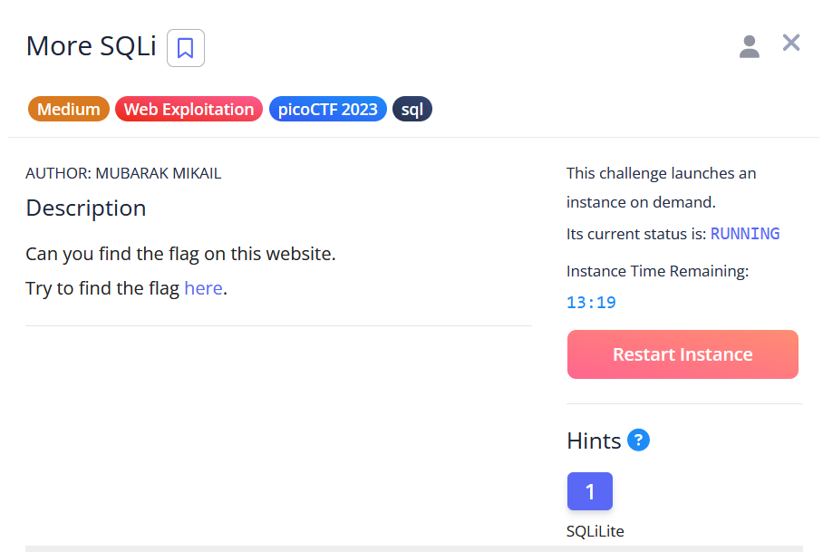
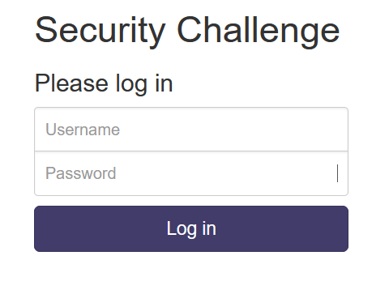
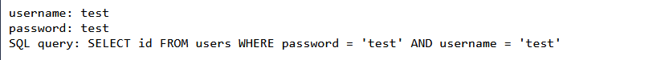
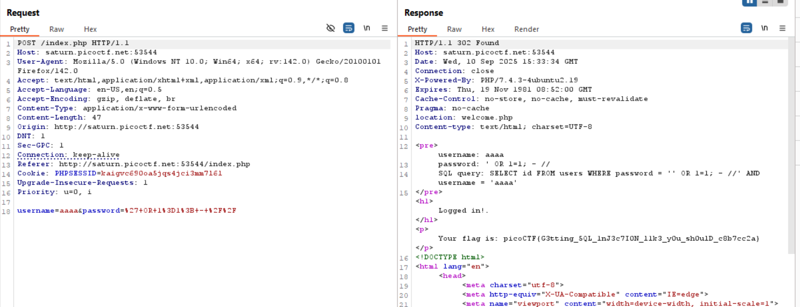

# More sqli



## Identifying the vulnerability

We are welcomed by login form



if we test an invalid credential, we will get an error message



## Exploiting the vulnerability

we can use this to do sql injection

```
username : whatever
password : ' or '1'='1
```

at first we get no flag, but if we try to login with burpsuite by intercepting the request and use repeater, we get the flag




